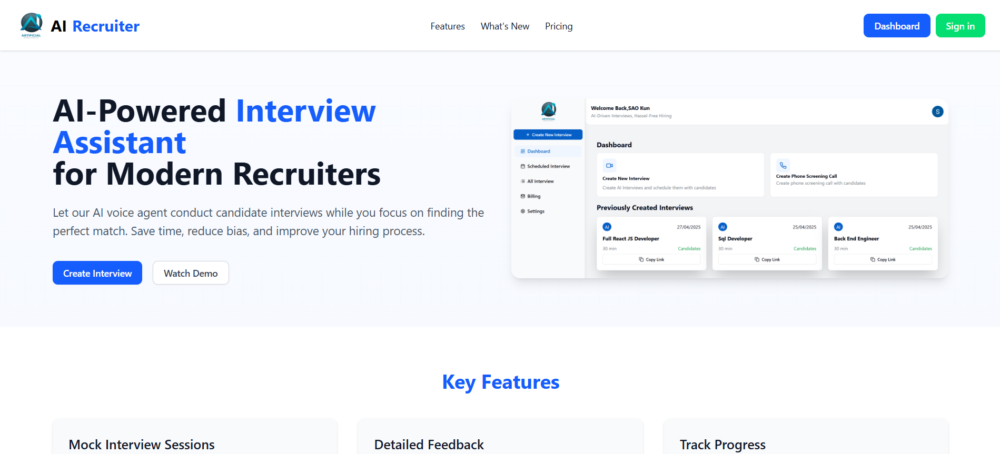
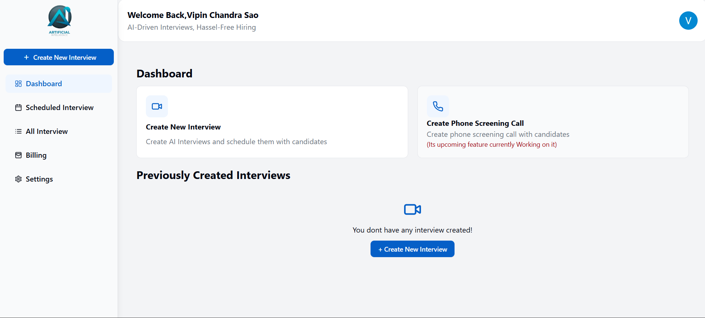
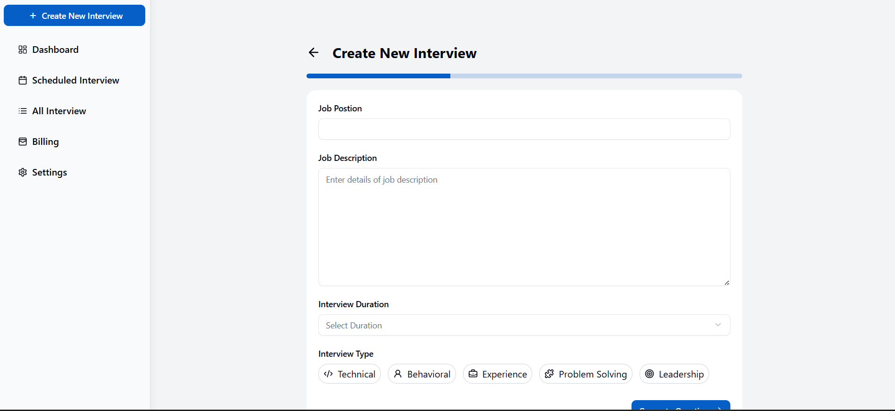
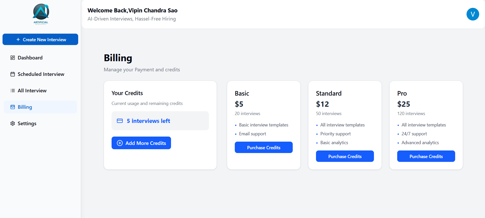

# 🧠 AI Interview Recruiter

A smart, modern web application that automates technical interview scheduling, candidate evaluation, and feedback collection using AI and real-time features.

---

## 🚀 Live Demo

🔗 [Click here to view the live app](https://ai-interview-agent-gules.vercel.app/)  
🎥 [Watch a demo video](https://drive.google.com/file/d/15x5dKG05FC5U26BiZ5P5UjnbHDauwMS0/view?usp=sharing)

---

## 📌 Features

- 🔐 **Authentication**
  - Google OAuth login using Supabase Auth
- 📅 **Interview Scheduler**
  - Create and schedule real-time interviews
- 👤 **Candidate Management**
  - Add, update, and view candidate data
- 📝 **Automated Feedback**
  - Collect AI-based ratings on multiple parameters
- 🧾 **Dynamic Interview Pages**
  - Unique interview pages with shareable links
- 📄 **Detailed Feedback Summary**
  - Technical Skills, Communication, Problem Solving, and Experience ratings
- 💻 **Modern UI**
  - Fully responsive UI built with Tailwind CSS

---

## 🛠️ Tech Stack

| Category       | Technology                    |
|----------------|-------------------------------|
| Frontend       | React.js, Next.js             |
| Styling        | Tailwind CSS, ShadCN UI       |
| Auth & Backend | Supabase (Auth + Database)    |
| Auth Provider  | Google OAuth                  |
| Deployment     | Vercel                        |

---

## 📷 Screenshots

>
## Homepage
>
## Dashboard
>
## Create Interview
>
## Billing
---

## ⚙️ Installation

### Clone the Repo

```bash
git clone https://github.com/your-username/ai-interview-recruiter.git
cd ai-interview-recruiter
```

### Install Dependencies

```bash
npm install
```

### Setup Environment

Create a `.env.local` file and add your Supabase keys and host URL:

```env
NEXT_PUBLIC_SUPABASE_URL=https://xyzcompany.supabase.co
NEXT_PUBLIC_SUPABASE_ANON_KEY=your-key
NEXT_PUBLIC_HOST_URL=https://your-vercel-deployment-url
```

### Run Locally

```bash
npm run dev
```

---

## 🧠 Architecture

```
Next.js (App Router)
├── Supabase Auth (Google OAuth)
├── Dynamic Routes (/scheduled-interview/[id])
├── Tailwind UI Components
└── Supabase DB Integration
```

---

## 🤝 Contributions

This project is built and maintained by **[Vipin Chandra Sao](https://github.com/vipinsao)**.

---

## 💼 Recruiter Notes

- ✅ Real-world project using **production-grade tech**
- ✅ Includes modern **auth**, **database**, and **cloud deployment**
- ✅ Clean, maintainable codebase with **reusable components**
